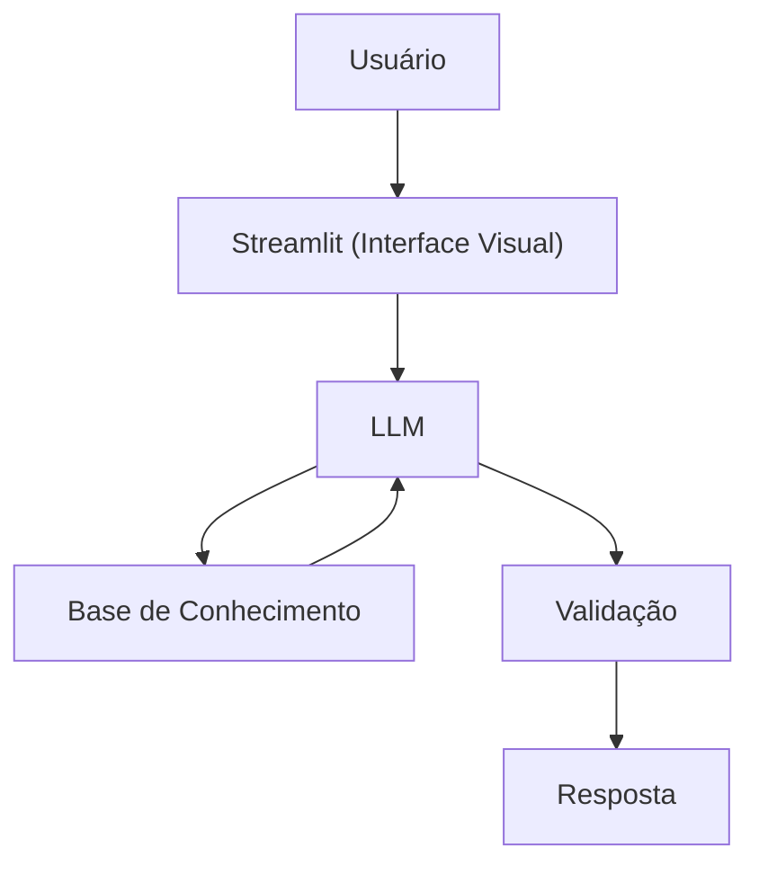

# 🤖 AADSL — Agente Financeiro Educativo com IA Generativa

Assistente virtual que ajuda **iniciantes em finanças pessoais** a se organizarem, com linguagem simples, exemplos práticos e sem julgamento.

> Projeto desenvolvido no desafio **BIA do Futuro** (DIO). Este repositório é um fork de [digitalinnovationone/dio-lab-bia-do-futuro](https://github.com/digitalinnovationone/dio-lab-bia-do-futuro).

---

## 📌 Sobre o projeto

### Problema
Muitas pessoas não conseguem juntar dinheiro, gastam mais do que deveriam, não têm reserva de emergência e sentem dificuldade em organizar os próprios gastos.

### Solução
O **AADSL** é um agente financeiro **educativo**: conversa com o usuário, explica conceitos e dá dicas práticas para ele se organizar financeiramente e evitar apertos.

### Público-alvo
Iniciantes em finanças pessoais.

---

## 🧑‍🏫 Persona do agente

- **Personalidade:** educativo, humilde, bom ouvinte e paciente.
- **Tom de voz:** informal, acessível e didático, como um professor.
- **Postura:** usa exemplos práticos e ajuda a evoluir, sem julgar.

---

## 🏗️ Arquitetura



| Componente           | Tecnologia                                   |
| -------------------- | -------------------------------------------- |
| Interface            | Streamlit                                    |
| LLM                  | Ollama (modelo local)                        |
| Base de conhecimento | Arquivos CSV e JSON na pasta `data/`         |

---

## 🛡️ Segurança e anti-alucinação

**Estratégias adotadas**

- Responde apenas com base nos dados fornecidos.
- Quando não sabe, admite.
- Não recomenda investimentos específicos.
- Não faz recomendação de investimento sem o perfil do cliente.

**Limitações declaradas**

- Não faz recomendações sobre investimentos.
- Não acessa dados bancários sensíveis (senhas, etc.).
- Não substitui um profissional certificado.

---

## 🗂️ Base de conhecimento

Dados mockados na pasta [`data/`](./data):

| Arquivo                     | Formato | Descrição                            |
| --------------------------- | ------- | ------------------------------------ |
| `transacoes.csv`            | CSV     | Histórico de transações do cliente   |
| `historico_atendimento.csv` | CSV     | Histórico de atendimentos anteriores |
| `perfil_investidor.json`    | JSON    | Perfil e preferências do cliente     |
| `produtos_financeiros.json` | JSON    | Produtos e serviços disponíveis      |

---

## 🚀 Como executar

> Ajuste os comandos conforme o seu `src/app.py` e o modelo que você usa.

```bash
# 1. Clone o repositório
git clone https://github.com/lecolimaa/dio-lab-bia-do-futuro.git
cd dio-lab-bia-do-futuro

# 2. Instale as dependências
pip install streamlit ollama

# 3. Baixe o modelo no Ollama (troque pelo modelo que você usa)
ollama pull <nome-do-modelo>

# 4. Rode a aplicação
streamlit run src/app.py
```

---

## 📁 Estrutura do repositório

```
├── README.md
├── data/        # Dados mockados (CSV e JSON)
├── docs/        # Documentação do projeto
├── src/         # Código da aplicação (app.py)
├── assets/      # Imagens e diagramas
└── examples/    # Referências e exemplos
```

---

## 📚 Documentação

| Documento | Conteúdo |
| --------- | -------- |
| [`01-documentacao-agente.md`](./docs/01-documentacao-agente.md) | Caso de uso, persona e arquitetura |
| [`02-base-conhecimento.md`](./docs/02-base-conhecimento.md) | Estratégia de dados |
| [`03-prompts.md`](./docs/03-prompts.md) | Engenharia de prompts |
| [`04-metricas.md`](./docs/04-metricas.md) | Avaliação e métricas |
| [`05-pitch.md`](./docs/05-pitch.md) | Roteiro do pitch |

---

## 📊 Avaliação

O agente é avaliado por:

- Precisão e assertividade das respostas
- Taxa de respostas seguras (sem alucinações)
- Coerência com o perfil do cliente

---

## 🛠️ Tecnologias

Python · Streamlit · Ollama · Mermaid


