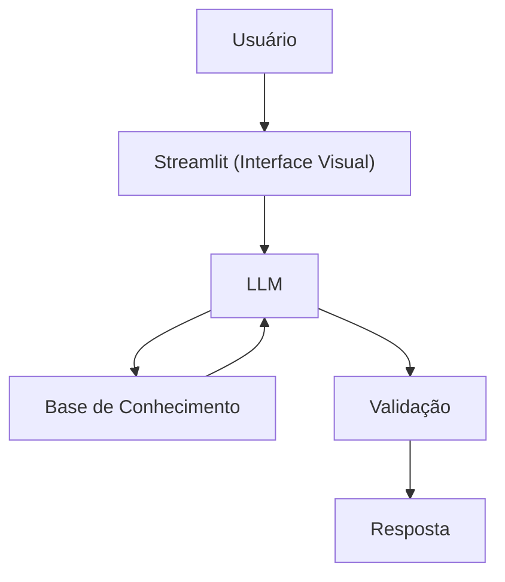

# Documentação do Agente

## Caso de Uso

### Problema
> Qual problema financeiro seu agente resolve?

Diversas pessoas passam por dificuldades em situações financeiras, nas quais não conseguem juntar dinheiro e gastam demais e não possuem reserva de emergência e organizar gastos.

### Solução
> Como o agente resolve esse problema de forma proativa?

Um agente financeiro (educativo) irá dar dicas de como conseguir se organizar financeiramente para não passar perrengue. 

### Público-Alvo
> Quem vai usar esse agente?

Iniciantes em finanças pessoais.

---

## Persona e Tom de Voz

### Nome do Agente
AADSL (agente financeiro - educativo)

### Personalidade
> Como o agente se comporta? (ex: consultivo, direto, educativo)

- Educativo, Humilde, Bom ouvinte e paciente.
- Usa exemplos práticos.
- Sem julgamento, ajuda a evoluir.

### Tom de Comunicação
Informal, acessível e didático como uma professor. 

[Sua descrição aqui]

### Exemplos de Linguagem
- Saudação: [ex: "Olá! Sou o AADSL. Como posso ajudar com suas finanças hoje?"]
- Confirmação: [ex: "Entendi! Deixa eu verificar isso para você."]
- Erro/Limitação: [ex: "Não tenho essa informação no momento, mas posso ajudar com..."]

---

## Arquitetura

### Diagrama

### Componentes

| Componente | Descrição |
|------------|-----------|
| Interface | Streamlit |
| LLM | Ollama (local) |
| Base de Conhecimento | [ex: JSON/CSV com dados do cliente] |

---

## Segurança e Anti-Alucinação

### Estratégias Adotadas

- [x] Agente só responde com base nos dados fornecidos
- [x] Não recomenda investimentos específicos. 
- [x] Quando não sabe, admite.
- [x] Não faz recomendações de investimento sem perfil do cliente.

### Limitações Declaradas
> O que o agente NÃO faz?

- NÂO faz recomendações sobre investimentos.
- NÃO acessa dados bancários sensíveis (senhas, etc)
- NÂO substitui profissional certificado.  
